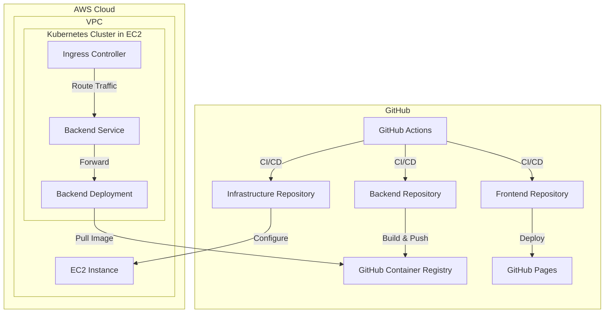
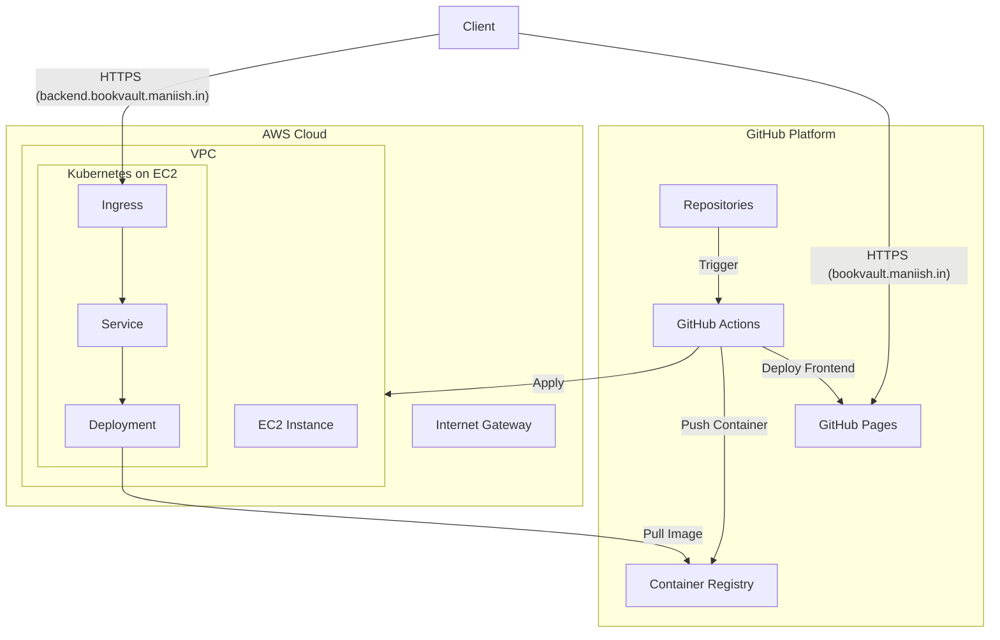

# 📚 Book Vault

Welcome to Book Vault - A Modern Book Management System

## 🏗️ Project Architecture



## 🌐 Project Overview
Book Vault is a comprehensive book management system split across three main repositories, each serving a specific purpose in the application architecture.

## 📂 Repository Structure

```
book-vault/
├── frontend/          # React frontend application
├── backend/           # Node.js backend service (Node 18.20.4)
└── infra/            # Infrastructure as Code (Terraform)
```

### Frontend Repository
- **Tech Stack**: React.js
- **Hosting**: GitHub Pages
- **URL**: [https://bookvault.maniish.in](https://bookvault.maniish.in)
- **CI/CD**: Automated deployment via GitHub Actions

### Backend Repository
- **Tech Stack**: Node.js (v18.20.4)
- **Container Registry**: GitHub Container Registry
- **Image**: `ghcr.io/book-vault/backend`
- **API Endpoint**: [https://backend.bookvault.maniish.in](https://backend.bookvault.maniish.in)

### Infrastructure Repository
- **Tech Stack**: Terraform
- **Cloud Provider**: AWS
- **Components**:
  - VPC Configuration
  - EC2 Instance with Kubernetes
  - Kubernetes Resources (Deployment, Service, Ingress)

## 🔧 Infrastructure Architecture



## 🚀 Deployment Flow

1. **Frontend Deployment**
   - Push to `main` branch triggers GitHub Actions
   - Build React application
   - Deploy to GitHub Pages
   - Available at `bookvault.maniish.in`

2. **Backend Deployment**
   - Push to `main` branch triggers GitHub Actions
   - Build Docker container
   - Push to GitHub Container Registry
   - Kubernetes pulls latest image
   - Exposed via Ingress at `backend.bookvault.maniish.in`

3. **Infrastructure Deployment**
   ```mermaid
   graph LR
       A[Terraform Code] -->|GitOps| B[GitHub Actions]
       B -->|Apply| C[AWS Resources]
       C -->|Create| D[EC2 with K8s]
       D -->|Deploy| E[Applications]
   ```

## 📡 Endpoints

- **Frontend**: `https://bookvault.maniish.in`
- **Backend API**: `https://backend.bookvault.maniish.in`
  - Protected with SSL certificates
  - Managed through Kubernetes Ingress

## 🔐 Security Features

- SSL/TLS encryption for all endpoints
- Container security scanning
- Infrastructure security through AWS VPC
- Kubernetes security policies

## 📝 Contributing

1. Fork the repository
2. Create your feature branch (`git checkout -b feature/AmazingFeature`)
3. Commit your changes (`git commit -m 'Add some AmazingFeature'`)
4. Push to the branch (`git push origin feature/AmazingFeature`)
5. Open a Pull Request

## 📄 License

This project is licensed under the MIT License - see the [LICENSE](LICENSE) file for details

## 👥 Contact

Project Link: [https://github.com/book-vault](https://github.com/book-vault)


---
---
### Reference 
- [Customizing your organization's profile](https://docs.github.com/en/organizations/collaborating-with-groups-in-organizations/customizing-your-organizations-profile)